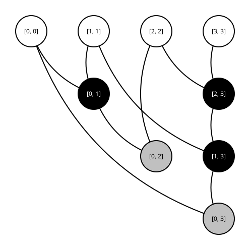

# prefix-topology-library

`prefix-topology-library` is the maintainer workspace for prefix-network topology data. Use it to generate source topologies, inspect derived artifacts, run module prelayout reports, curate Pareto frontiers, and refresh checked-in topology roots.

The parent [`playground`](../README.md) flow builds one selected wrapper implementation from existing topology data. This directory prepares and reviews the topology data that the parent flow consumes.

| Need | Workspace |
| --- | --- |
| Generate or inspect source prefix topologies | this directory |
| Measure topologies for `PrefixAdder` or `PrefixAbsDiff` | this directory |
| Curate Pareto frontier artifacts | this directory |
| Build one selected wrapper implementation | parent [`playground`](../README.md) root |

The library supports widths $1$ through $128$ for `PrefixAdder` and `PrefixAbsDiff`. The default maintainer interval fully enumerates widths $1$ through $4$. Widths outside the selected interval are still materialized, but only with the ripple topology and its derived frontier point.

Workspace boundary:

- this directory owns topology roots, generated diagrams, module RTL, prelayout reports, and Pareto summaries
- the parent repository root owns one-config wrapper generation from an already selected implementation
- source topology names such as `ripple` and `variant_<k>` stay in full width-first roots
- parent-flow implementation names such as `area_<i>` and `timing_<i>` stay in module-first frontier roots

## Maintainer Loop

Start with disposable roots under `generated/`. Promote checked-in roots only after review.

1. Generate a disposable full width-first root with `make topologies`.
2. Inspect representative `topology.json`, `dyck.json`, SVG, RTL, and reports.
3. Review each affected module's `pareto_frontier.json` and frontier SVG.
4. Curate a disposable module-first frontier root with `make frontier`.
5. Build at least one parent wrapper against that disposable frontier root.
6. Refresh checked-in `sample_topologies/` or `pareto_frontier_topologies/` only after the disposable output is accepted.

Promotion checks:

- compare affected JSON and SVG files against previous checked-in versions
- verify at least one parent wrapper build against the refreshed frontier root
- keep disposable `generated/` roots local or remove them
- promote only reviewed `sample_topologies/` or `pareto_frontier_topologies/` outputs

For small doc or schema reviews, the shared width-$4$ example below is usually enough context. For data refreshes, inspect every affected width and both modules.

| Stage | Review |
| --- | --- |
| after `topologies` | source topology directories, derived JSON, SVGs, RTL, and prelayout metrics |
| after `frontier` | module-first `area_<i>` directories, `timing_<i>` aliases, and copied reports |
| before promotion | checked-in-root diff plus one parent wrapper build against the refreshed frontier |

## Quick Start

Run commands in this directory.

```bash
make <target> [VAR=value ...]
```

From the parent repository root, use `make -C`.

```bash
make -C prefix-topology-library <target> [VAR=value ...]
```

Safe inspection command:

```bash
make inspect TOPOLOGY=sample_topologies/width_4/variant_2/topology.json
```

Disposable generation commands:

```bash
make topologies TOPOLOGIES=generated/topologies MAX_WIDTH=4
make frontier TOPOLOGIES=generated/topologies FRONTIER=generated/frontier MAX_WIDTH=4
```

With these defaults, `topologies` materializes every supported width from $1$ through $128$, but only widths $1$ through $4$ contain non-ripple variants. The disposable `frontier` command above curates widths $1$ through $4$ from that generated source root.

Checked-in sample refresh:

```bash
make samples SAMPLES=sample_topologies MAX_WIDTH=4
```

The `samples` target intentionally refreshes a checked-in root. Review its diff before committing it.

## Roots And Rewrite Behavior

Most maintainer commands take destination roots as variables. Treat the destination as part of the operation.

| Root | Intended use |
| --- | --- |
| `generated/topologies` | disposable full width-first topology root |
| `generated/frontier` | disposable module-first Pareto frontier root |
| `sample_topologies` | checked-in full width-first sample root |
| `pareto_frontier_topologies` | checked-in module-first frontier root consumed by the parent flow |

The library uses two root shapes:

| Root shape | Path pattern | Purpose |
| --- | --- | --- |
| full width-first root | `<root>/width_<width>/<source>/` | preserves source topology provenance |
| module-first frontier root | `<root>/<module>/width_<width>/area_<i>/` | exposes curated implementation points to the parent flow |

Keep the shapes separate. Parent-flow configs should point `frontierDir` at a module-first frontier root, not a full width-first root.

Maintainer targets rewrite output roots by design. Check paths before running them against checked-in roots, especially `FRONTIER` and `SAMPLES`.

| Target | Reads | Writes | Runs prelayout? |
| --- | --- | --- | --- |
| `inspect` | one `topology.json` | stdout only | no |
| `topologies` | topology enumerator | full width-first root at `TOPOLOGIES` | yes |
| `frontier` | full width-first root at `TOPOLOGIES` | module-first root at `FRONTIER` | no |
| `samples` | topology enumerator | sample full width-first root at `SAMPLES` | yes |

Operational notes:

- `inspect` does not edit files.
- `topologies` and `samples` remove supported `width_<n>` directories before rebuilding them.
- `frontier` removes and rewrites requested destination `width_<n>` directories under each module.
- `frontier` copies existing reports from `TOPOLOGIES` and does not rerun prelayout; regenerate `TOPOLOGIES` first if metrics are stale.
- These targets do not modify parent wrapper outputs.

Width behavior:

- `topologies` and `samples` always visit supported widths $1$ through $128$.
- `MIN_WIDTH` and `MAX_WIDTH` choose which widths get full non-ripple enumeration.
- `frontier` curates only the requested interval from an existing full width-first root.

Before running a rewriting target, confirm:

1. `TOPOLOGIES`, `FRONTIER`, or `SAMPLES` points at the root you intend to replace.
2. `MIN_WIDTH` and `MAX_WIDTH` cover only the widths you intend to fully enumerate or refresh.
3. `WORKERS` is appropriate for the local machine when generating topologies.
4. The real prelayout toolchain is available, or `PREFIX_TOPOLOGY_LIBRARY_FAKE_RUNNER_JSON` is intentionally set for tests.

## Artifact Authority

Every topology directory has one source of truth: `topology.json`. Derived files exist for review, measurement, and downstream consumption.

| Artifact | Status | Contents |
| --- | --- | --- |
| `topology.json` | authoritative | dependencies and labeled `suffix` trees |
| `dyck.json` | derived companion | same dependencies and shape-only `shape` fields |
| `topology.svg` | derived | rendered topology diagram |
| RTL and `filelist.f` | derived | generated module RTL files and file list |
| `prelayout.json` | derived | metrics, constraints, toolchain versions, and RTL file paths |
| `pareto_frontier.json` and `.svg` | derived | module-specific frontier summary for one width |

When artifacts disagree, regenerate derived files from `topology.json`. Do not treat `dyck.json`, SVGs, RTL, reports, or Pareto summaries as alternate topology inputs.

Normative JSON contracts:

- [Topology JSON Specification](docs/topology-json-spec.md): authoritative `topology.json`
- [Dyck JSON Specification](docs/dyck-json-spec.md): derived companion `dyck.json`

## Root Shapes

`topologies` and `samples` always materialize all supported widths from $1$ through $128$. `MIN_WIDTH` and `MAX_WIDTH` select the full-enumeration interval:

- widths inside the interval contain `ripple` plus all `variant_<k>` topologies
- widths outside the interval contain only `ripple`

Full width-first root:

```text
<root>/
  width_4/
    ripple/
      topology.json
      dyck.json
      topology.svg
      PrefixAdder/
        rtl/
        sc/
      PrefixAbsDiff/
        rtl/
        sc/
    variant_0/
      ...
    PrefixAdder/
      pareto_frontier.json
      pareto_frontier.svg
    PrefixAbsDiff/
      pareto_frontier.json
      pareto_frontier.svg
```

Module-first frontier root:

```text
pareto_frontier_topologies/
  PrefixAdder/
    width_4/
      pareto_frontier.json
      pareto_frontier.svg
      area_0/
        topology.json
        dyck.json
        topology.svg
        rtl/
        sc/
```

In a module-first frontier root, `timing_<i>` names are aliases stored in `pareto_frontier.json`; they are not directories. With the default interval, checked-in roots contain fully enumerated width data for widths $1$ through $4$ and ripple-only materialization for wider supported widths.

## Naming And Frontiers

A topology has positive width $n$ and exactly $n - 1$ ordered construction steps. For width $n$, the enumerator produces $\prod_{i = 0}^{n - 2} \sum_{j = 0}^{i} C_j$, where $C_j$ is the $j$-th Catalan number.

Full width-first source topology names are deterministic.

| Local index | Source topology name |
| --- | --- |
| $0$ | `ripple` |
| $k + 1$ | `variant_<k>` |

Pareto summaries use `areaUm2` and `clockPeriodNs`; lower is better for both. Frontier entries keep only points that improve minimum clock period as area increases.

| Name | Ordering |
| --- | --- |
| `area_<i>` | `areaUm2`, then `clockPeriodNs`, then source rank |
| `timing_<i>` | `clockPeriodNs`, then `areaUm2`, then source rank |

Each `pareto_frontier.json` entry records the materialized `area` name, timing alias, original source topology, and metrics. Compare `area_<i>` and `timing_<i>` names only within the same module and width.

## Shared Example

This README and both JSON specs use [`sample_topologies/width_4/variant_2`](sample_topologies/width_4/variant_2) as the shared example.

```bash
make inspect TOPOLOGY=sample_topologies/width_4/variant_2/topology.json
```

`make inspect` prints canonical topology content plus derived cell counts.

```json
{
  "topology": {
    "width": 4,
    "steps": [
      {"dependency": 0, "suffix": {"leaf": 1}},
      {"dependency": 1, "suffix": {"leaf": 2}},
      {
        "dependency": 0,
        "suffix": {
          "node": [
            {"leaf": 1},
            {"node": [{"leaf": 2}, {"leaf": 3}]}
          ]
        }
      }
    ]
  },
  "cellCounts": {
    "blackCellCount": 3,
    "grayCellCount": 2
  }
}
```

The same directory contains the authoritative `topology.json`, derived `dyck.json`, rendered `topology.svg`, generated RTL, and module prelayout reports.



## Command Reference

| Command | Description |
| --- | --- |
| `make help` | show targets and current defaults |
| `make inspect` | print canonical topology JSON and cell counts from `TOPOLOGY` |
| `make topologies` | generate full width-first topology artifacts in `TOPOLOGIES` |
| `make frontier` | curate module-first Pareto frontier artifacts into `FRONTIER` |
| `make samples` | refresh checked-in sample topology artifacts in `SAMPLES` |
| `make check` | run formatting checks and tests |
| `make test` | run tests |
| `make lint` | check source formatting |
| `make format` | format source files |
| `make clean` | remove generated topology files |
| `make clean-all` | remove generated topology files and Mill state |

| Variable | Default | Meaning |
| --- | --- | --- |
| `TOPOLOGY` | `<prefix-topology-library>/sample_topologies/width_4/variant_2/topology.json` | input for `inspect` |
| `TOPOLOGIES` | `<prefix-topology-library>/generated/topologies` | destination for `topologies`; source for `frontier` |
| `FRONTIER` | `<prefix-topology-library>/pareto_frontier_topologies` | destination for `frontier` |
| `SAMPLES` | `<prefix-topology-library>/sample_topologies` | destination for `samples` |
| `MIN_WIDTH` | $1$ | first fully enumerated width |
| `MAX_WIDTH` | $4$ | last fully enumerated width |
| `WORKERS` | $1$ | worker count for topology generation |
| `MILL_JOBS` | detected CPU count, capped at $4$ | Mill parallelism |
| `MILL` | `<prefix-topology-library>/mill` | checked-in Mill launcher |
| `MILL_FLAGS` | `--no-daemon -j $(MILL_JOBS)` | flags passed to Mill |

## Requirements

Required for `inspect`, tests, and formatting checks:

- JDK `17`
- `make`
- `bash`
- the checked-in `./mill` launcher
- writable Coursier and XDG cache locations, or explicit cache variables

Additional requirements for `topologies` and `samples` with real prelayout reports:

- `$HOME/siliconcompiler/.venv/bin/python`
- Python packages `siliconcompiler` and `lambdapdk`
- `yosys` on `PATH`
- `sta` on `PATH`
- network access on first run if the Lambda PDK archive is not cached

Tests can exercise report paths without the real prelayout toolchain by setting `PREFIX_TOPOLOGY_LIBRARY_FAKE_RUNNER_JSON` to a JSON payload with `metrics` and `toolchain` fields.

## Related Docs

- [Parent wrapper README](../README.md): one-config RTL and prelayout generation
- [Topology JSON Specification](docs/topology-json-spec.md): authoritative `topology.json` format
- [Dyck JSON Specification](docs/dyck-json-spec.md): derived companion `dyck.json` format
